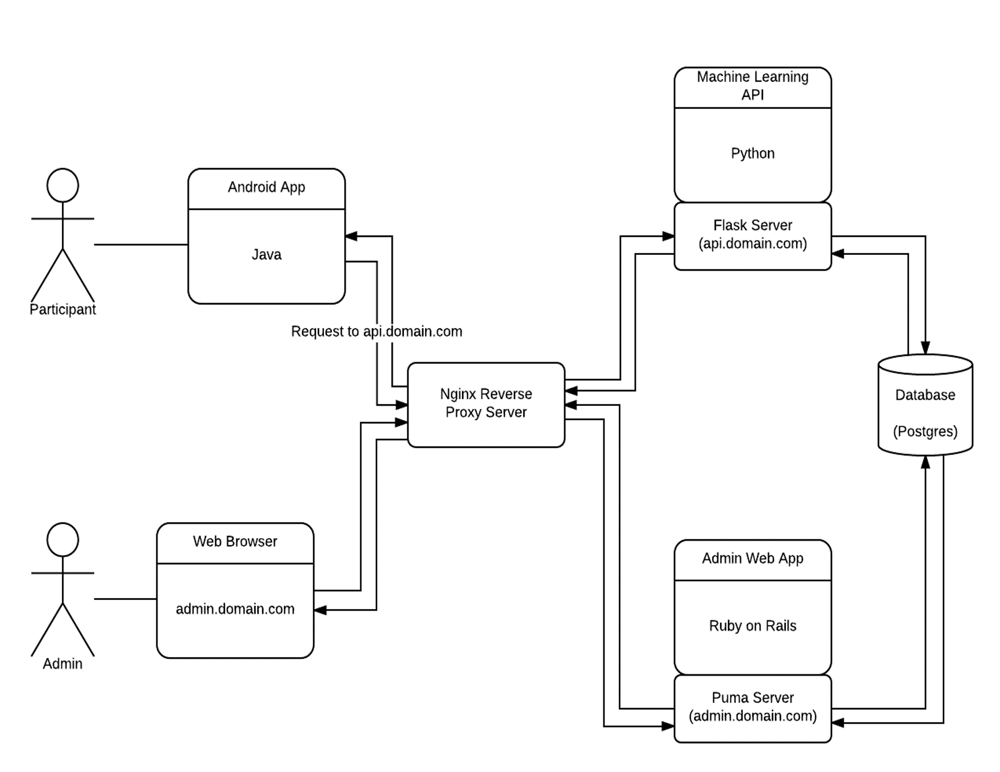

## PROJECT OVERVIEW

Equipped with sensors, smartphones can measure physical health (e.g., heart rate, blood pressure). A current priority of the National Institute of Mental Health is to develop similarly precise measures of mental health (e.g., memory, attention, risk-taking behavior). The delayed discounting game (example to the right) measures an individual's attitude toward delaying gratification. Performance on the task correlates with substance abuse. The sponsor’s group embeds machine learning (Bayesian adaptive testing) in the game to make it "smarter," meaning it takes less time to complete (< 2 minutes) and the results are more informative (precise). A browser-based version of the game (and others like it) are available to researchers and clinicians.
The goal of the current project was to develop a smartphone version of the delayed discounting game. The need arose out a desire to increase ease playing the game and the environments in which it could be administered.

## PRODUCT DESIGN

There are three parts to this application, the *Android application* (phoneapp), the *administrative web application* (phoneapp-admin), and the *API* (phoneapp-api). As seen in the diagram below, the API and the admin web app server reside on the same box on AWS. This box also hosts the database which is only accessible locally by the admin app and the API. The database is not open externally and thus any actions to the database must be made locally (or through an SSH tunnel) to that box hosting the servers.  These servers reside behind an Nginx reverse proxy server which manages connections to the box. The expected workflow is that the phoneapp will “talk to” the API to perform database actions and the admin interface will be interacted with via a desktop web browser.

_Fig. 1. Project Infrastructure_

## Administrative Web Application

The web application is a Ruby on Rails project running on a standard Puma server and is hosted at mybrainstudyapp.com. The website is built upon the ActiveAdmin framework which is a framework designed to work with ActiveRecord and provide common administrative tasks such as view data from a database, create, edit, destroy records in a database, and download the results as CSV files. We decided to use this framework as it seemed to contain all of the features we were looking for and would help to simplify the development of the application.

## Machine Learning API
The API is a Python project running on a standard flask server and is hosted at phoneapp-api.mybrainstudy.com. The API should be used to allow the Android application to interface with the database and the question creating machine learning algorithm.  Python was the chosen language since the machine learning algorithm was already written in Python so this was going to be the easiest way to interface with that algorithm.

## Android Application

The Android application is a standard application targeting Android 4.4+ (KitKat+) to cover most modern users.  For the most part this is a simple and standard Android application. Anything that is out of the ordinary is commented in the code.

One feature that is unique of this application is the notification system. Rather than the standard push notification system we are using a pull style notification system. This is due to the unique constraints of the application where we need notifications to be sent to a subset of our users (based upon which experiment they are in) and we also need to maintain anonymity so we cannot collect device data to push notifications selectively in that way. Therefore, it is setup so that a background task runs every 5 minutes to check for a new test session which has notifications set to true. It will then alert the user if the session is currently open or wait until next time it runs and again either post the notification or wait until the session has opened. It will also send a second notification when 75% of the time in the session has elapsed to remind the user to play before the end of their test session.

## Postgres Database
This is a standard Postgres database. It is hosted locally on the AWS server alongside the admin application and the API. The Rails models should match the database configuration except we had to manually configure the cascade on delete option in Postgres for proper record deletion.
