## INTRODUCTION
The goal of this project is to look into the data collected by the US census bureau and
identify the features that have significant impact on individual's income.
There are 48,842 instances, mix of continuous and discrete records with
fifteen features. Data came originally split into (⅓ test data and ⅔ training data) which I
decided to combine them for my analysis and split them later for model development.
The following table shows a sample of the data:

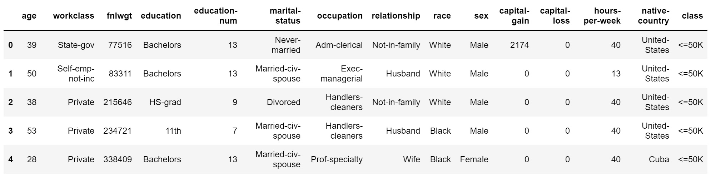
_Fig. 1. Sample of data_

The last column indicates the class label which is the gross income with threshold of
50K. Prediction task is to determine whether a person makes over 50K a year. The
approach that I am taking during this report is to first do some preliminary data analysis
to understand data and then build different models and evaluate their performance.

## PRELIMINARY DATA ANALYSIS AND DATA TRANSFORMATION

To get some insights and find trends I went over the data, feature by feature and
tried to find the impact of each feature on the class label. Before getting started with
analysis I realized that there are 2,399 records with at least one missing value. The
number was significant and dropping the records was not an option. So I ran further
analysis to categorize the records with missing values and the results are illustrated in
the following table:

|Records with 1 missing value | 821 |
|Records with 2 missing value |2753|
|Records with 3 missing value|46|
|Total number of missing values|3620|
|Total number of infected records|2213|

 
To handle the missing values I decided to estimate them using 3-nearest neighbor
method. For example to estimate a missing value I find the three most similar
instances and take the vote. This approach makes sense because the number of records
with missing values are high and by estimating the missing fields they can still be valuable. Missing values originally were represented with a single
character of ‘ ?’ in the dataset that I replaced them with NaN value to get advantage of
python’s data mining tools.

Starting with ‘ **age** ’ column I grouped the values based on their class label and took the
average age of the each class. Interestingly the average age of the records who earned
equal or less than 50K was 36 and average age of the instances above 50K was 44.
The youngest instance was 17 and the oldest 90 years old. I ran the same algorithm
using median instead of mean and I got 34 as a median of the records with class label
below 50K and 44 as the median of the instances with a label of above 50K. Following
figure illustrates the distribution of age in each class.  

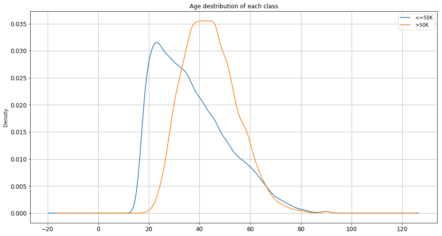
_Fig. 2. age distribution in each class_

The outcome is reasonable as it was expected. People with higher average age earn
more than younger population. From figure 2 there is a sweet spot around age 38, 39
that is a good candidate to be used as a splitting point. I used age 39 to binarize this
feature meaning that ages above 39 assigned label 1 and ages below or equal got label
0.

In ‘**workclass**’ column there are 8 nominal categorical values in total. Values are
“_Private, Self-emp-not-inc, Self-emp-inc, Federal-gov, Local-gov, State-gov,
Without-pay, Never-worked_”. To understand the relation between ‘**workclass**’ and income
range I decided to group the records based on their ‘**workclass**’ value and calculate the
frequency of the classes in each category. Following bar chart shows the outcome of
this analysis.

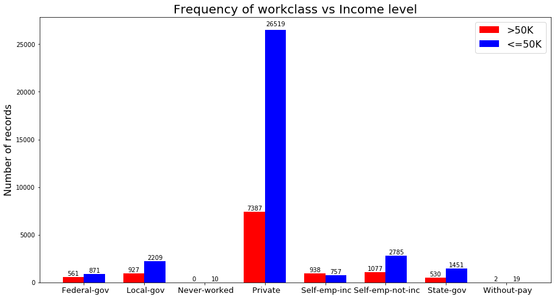
_Fig. 3. workcalss vs income_

Looking at each pair of bars in figure 3, we can compare the number of people in each
‘**workclass**’ that has income above and below 50K. For example the number of people
who are employed at ‘_Private_’ sector and earn below 50K are 3.5 times greater than
those who earn more than 50K in the same category. ‘_Self-emp-Inc_’ is the only
category that the number of high-income records is greater than the low-income ones.
‘_Never-worked_’ is the categories that has no record with high income.

To be able to use this feature in my models, I binarized this feature by adding 8 more
columns to my dataset with binary values and dropping the original column. Columns
named according to the values of this feature and each record got value 0 or 1
depending on it’s value.

Column ‘**fnlwgt**’ was the most challenging feature to analyze since it didn’t carry any
meaning by itself. According to the data description file, ‘**fnlwgt**’ is a shortened name for
final-weight which is a kind of a measure consists of number of several attributes. This
is a feature with continuous values in interval [ 12285, 1484705 ]. To understand this
feature I plot the distribution of this feature in each class.

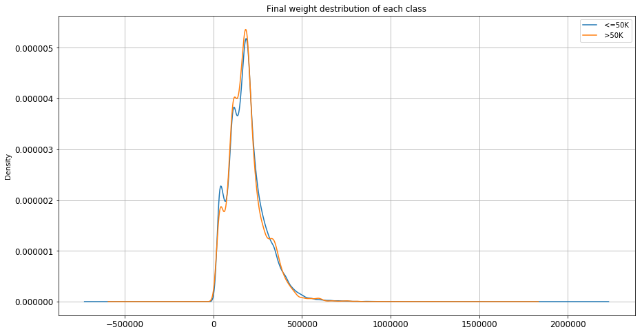
_Fig. 4. fnlwgt distribution in each class_

As it can be seen from Figure 4, distribution of this continuous feature is almost identical
in both categories. Meaning that records with the same ‘**fnlwgt**’ value can be equally
likely in either of the classes. This is indicating that this feature is not providing value for
our analysis. So I decided to drop this value during Model developing.

‘**education**’ and ‘**education-num**’ are representing similar ideas but in different format.
‘**education**’ has string values and ‘**education-num**’ has integer values showing the
number of years that an instance has studied. I decided to pick ‘**education**’ for my
analysis and use ‘**education-num**’ in my models. I grouped the similar values together
and calculated the percentage of high income and low income in each category.
The following stacked bar-chart illustrates the results:

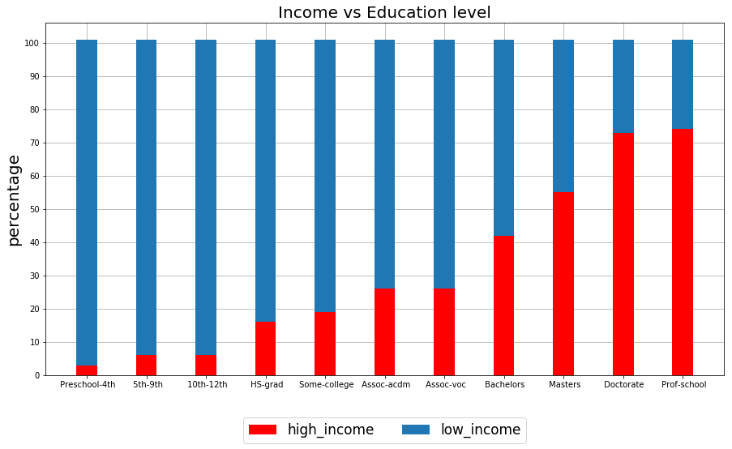
_Fig. 5. education vs income level_

Observing figure 5 there is a positive strong correlation between ‘**education**’ column and
class label. As the level of education increases the percentage of records with high
income increases as well. Proportion of high-income Instances among those who are
not graduated from high school is less than 10% where the proportion of high-income
records with masters degree or higher is above 50%.
I dropped the ‘**education**’ column after my analysis and kept ‘**education-num**’ column for
using in my models. Since the values of this feature are integers and they can be used
both as categorical and continuous, I decided to keep them as is.

Analyzing ‘**marital-status**’, I grouped all the values and get the frequency of the class
label in each category. Following histogram shows the results:

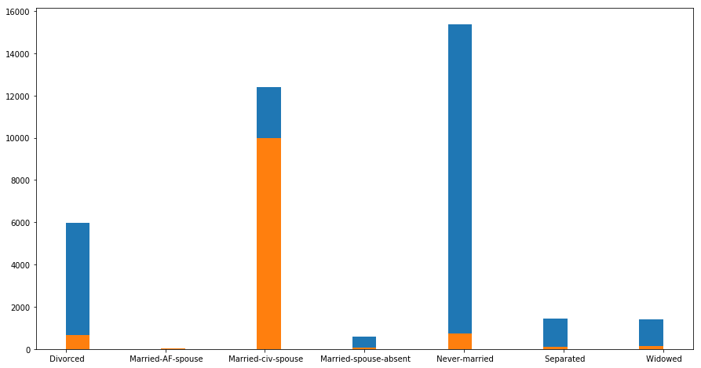
_Fig. 6. marital status vs income level_

Looking at figure 6, in category ‘_Married-civilian-Spouse_’ records with income level over
50K is dominating compared to the other categories where most of the instances have
income below 50K. This is a good indicator of a class label and provide us valuable
information. To use this categorical feature in my models I binarized the values and add
seven more columns to my matrix having binary values. After transformation I dropped
the original column.

To analyze the ‘**occupation**’ column, since it is a categorical feature I grouped them in
categories and plot the following bar chart for comparison:

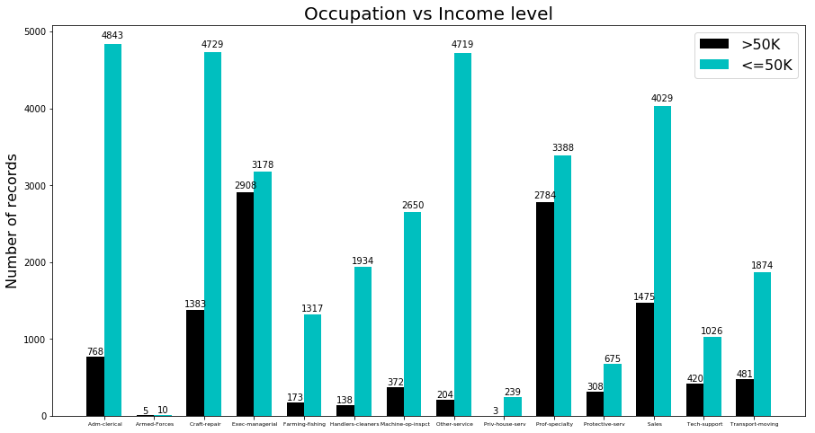
_Fig. 7. occupation vs income level_

Looking at figure 7, we can see that there is no single category that the number of
records with high income exceeds the ones with low income. But in some categories
like ‘_executive managers_’ number of instances in each class are close to each other. On
the other hand in categories like services, the difference between two classes is
extreme. By looking at the results we can identify a significant correlation between
Occupation and class label which can help us in our predictions.
To transform this feature to a usable format in my models I binarized the values by adding
columns with the name of each categorical value and I dropped the original column.

For the categorical features I follow the same approach and following are the results for
three different features ‘**Relationship**’, ‘**race**’ and ‘**sex**’.

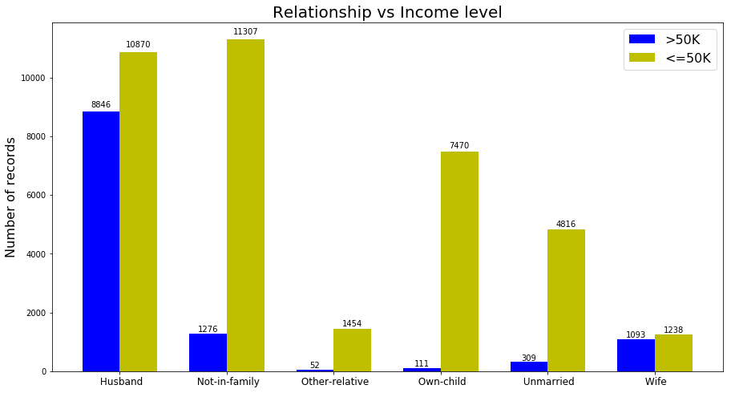
_Fig. 8. relationship vs income level_

The term ‘**relationship**’ and it is relation to Income level was a little bit ambiguous for me.
And I had problems understanding this feature. But just plotting this feature we can see
that there is a significant correlation between this attribute and income level. Although in
all the categories, the number of instances with high income are lower than the ones
with lower income but the difference is not the same. For example in the category
‘_Husband_’ the number of instances in each class are close to each other.

For transformation I binarized the values and add new columns to the data set and
dropped the original feature.

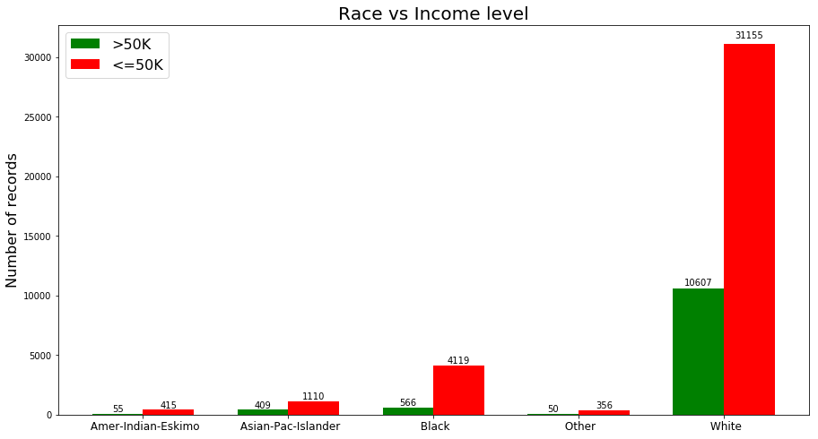
_Fig. 9. race vs income level_

As we can see from figure 9 the majority of the instances are white. The proportion of
the instances in each category is different and this can tell us about the significance of
this feature. For example in category ‘_Black_’ number of low-income records are seven times
greater than high-income records, where in category ‘_White_’ the number of low-income
instances are three times greater than the high-income instances.

I binarized this feature and add new columns to my Data and dropped the original
column.

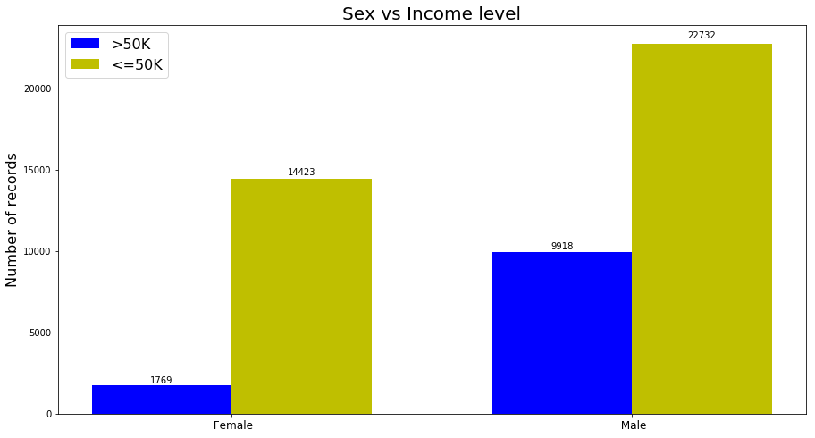
_Fig. 10. sex vs income level_

Figure 10 shows the distribution of classes in different categories. The proportion of the
classes are very different and this makes this feature important. The ratio between
high-income and low-income in ‘_male_’ category is 2.3 where this ratio in ‘_female_’ category
is 8. Meaning that more instances in ‘_female_’ category are getting paid lower than 50K.
To use this feature in my models I mapped the values to zero and one.

The following figure shows the distribution of capital-gain in each class:

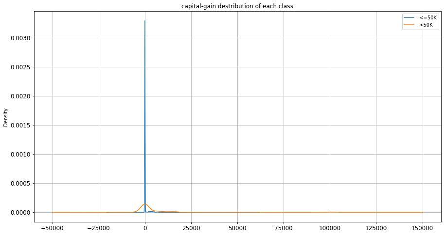
_Fig. 11. capital-gain distribution_

The majority of the records have zero capital-gain. Interestingly records in both of the
classes shows similar behavior. Although one might expect to see more gain in
high-income class but the difference is not dramatic in this case.

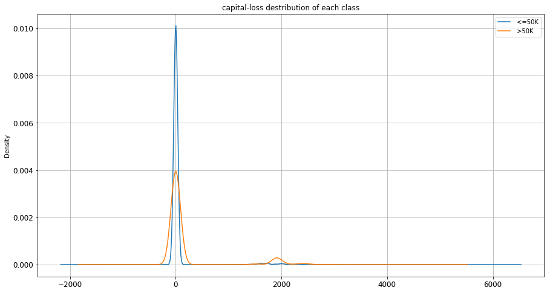
_Fig. 12. capital-loss distribution_

Capital loss also shows the same kind of behavior as capital-gain. In figure 12,
distribution of capital-loss in both classes are very much similar.

## Model Development and Evaluation

I developed five different models for this project following are the results of the model’s
performance:

_model A: Decision Tree_

|Recall|0.946|
|Precision |0.872|
|Error Rate | 0.147 |
|Accuracy|0.852|
|F1 Score|0.907|

 
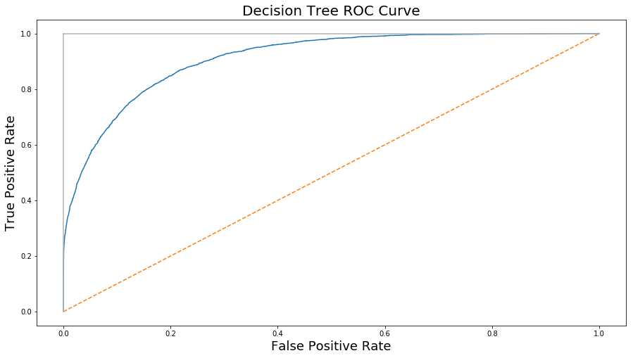
_Fig. 13. Decision Tree ROC curve_

_model B: Artificial Neural Network_

|Recall|1|
|Precision |0.764|
|Error Rate | 0.235 |
|Accuracy|0.764|
|F1 Score|0.866|

 

_Fig. 14. Artificial Neural Network ROC curve_

_model C: Support Vector Machine_

|Recall|0.75|
|Precision |0.91|
|Error Rate | 0.24 |
|Accuracy|0.757|
|F1 Score|0.826|

 
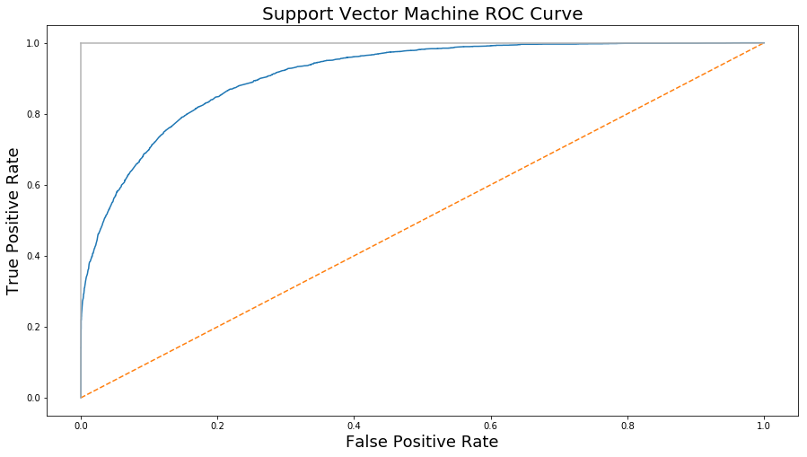
_Fig. 15. Support Vector Machine ROC curve_

_model D: Ensemble Learner (Adaboost)_

|Recall|0.935|
|Precision |0.886|
|Error Rate | 0.14 |
|Accuracy|0.859|
|F1 Score|0.91|

 
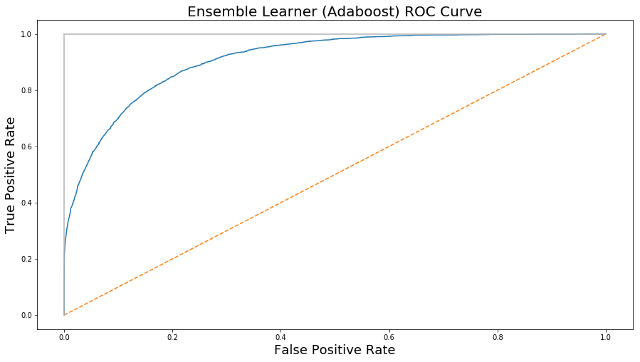
_Fig. 16. Adaboost Model's ROC curve_

_model E: Logistic Regression_

|Recall|0.93|
|Precision |0.88|
|Error Rate | 0.147 |
|Accuracy|0.85|
|F1 Score|0.906|

 
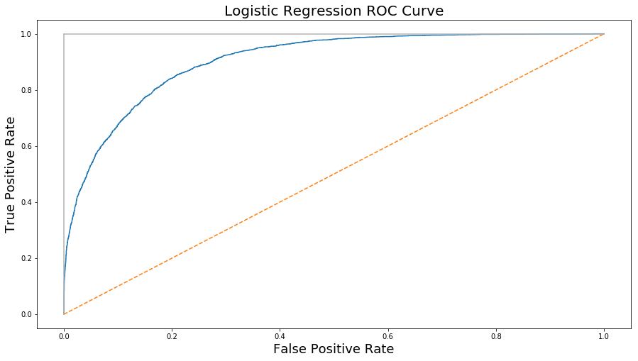
_Fig. 17. Logistic Regression ROC curve_

## Result

The Ensemble Learner (Adaboost) did the best among all the models with a F1 Score of
0.91 and Decision tree placed second with F1 Score of 0.907. Logistic regression model
did very close to decision tree model with a F1 score of 0.906 and there were not a
huge difference among them. But two other models ANN and Support Vector Machine
did weaker compared to the prior models. ANN model got the F1 Score of 0.86 and
SVM got the F1 Score of 0.82.
