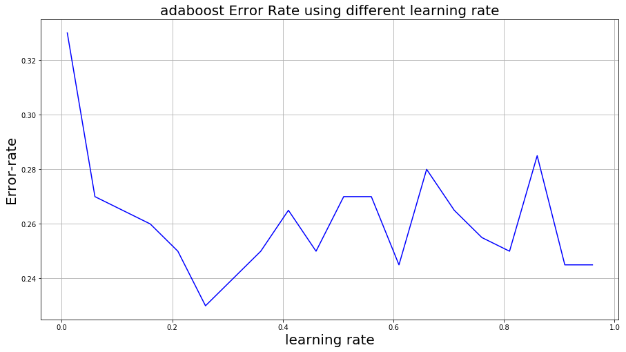

## INTRODUCTION
Understanding user reviews and being able to
classify a large number of comments play crucial role
for businesses. Therefore Yelp.com recently has initiated a
Data mining / Machine learning competition and invited
students to explore Yelps dataset and discover interesting
insights and patterns. The Interaction between the
user and the Yelp application is based on the reviews
which are initiated some keywords potentially ranked
by ratings. The goal of this project is to explore the
reviews from users on Yelp.com and answer if a review
is positive or negative. Reviews are stored as plain text
and requires some Natural Language Processing in order
to give it a structure and transforms it into a machine-learning
usable format. Following is the diagram that
shows this projects architecture:

_Fig. 1. Architecture of System_

As it can be seen from figure 1, after downloading the
dataset from Yelp.com, Text is tokenized and stopping
terms e.g. “a” , “the” are removed. Stemming has done
during the bagging process to get a less sparse Term
Matrix (TF). Each term has given a weight using the
Term Frequency and Inverse Document Frequency methods.
Since the resulted matrix has too many columns,
number of dimensions reduced by identifying the principal
components. And then model is trained based on
the calculated matrix. In the following sections you will
find the detailed explanation of each step and the model
evaluation at the end.

## DATASET
The data provided by Yelp is called “yelp review”
dataset which is extracted from their database. The
“yelp review” dataset includes information regarding to
restaurants on various cities all across the world. There
are 5,261,668 instances with nine features [3]. Figure 2,
is showing a sample of this data:

_Fig. 2. Sample of Data_

_A. Feature selection_

Features like “review id”, “user id”, “business id” and
“date” do not contribute to our goal and are irrelevant
to the topic so they are dropped in this analysis. Also
Columns “useful”, “funny” and “cool” are not rated by
every user and are pretty sparse and they are not going
to be used in this report.
On top of the reasons explained, the main purpose of
this project is to focus on the sole text and figure out
if a comment is positive or negative so the only feature
beside “text” is “stars” column that is used as the label
of records. “Stars” column has integer values ranging
from 1 to 5 which shows how satisfied is a user from
that specific place.
Another point to mention is that the number of records
is too many to be handled in a personal computer
especially considering the text mining aspect of it. So a
subsample of 1,000 records is extracted for analysis and
model development purpose. Following figure shows the
frequency of the ratings in sample of 1000 instances.

_Fig. 3. Distribution of ratings in a sample of 1000
records_

As it can be seen from figure 3, 65% of the records
are rated as four and five stars and 35% are given one,
two or three stars. To identify the negative and positive
comments based on number of stars, can be challenging
since the borderline of positivity or negativity is not
well-defined. Meaning that a comment rated 3 can have
both positive and negative sides. But it is a safe bet to
consider comments which are rated 4 or 5 as positive
comments and the rest not positive if not necessarily
negative ones. “stars” column binarized by mapping “4”
and “5” to class label “1” and the rest as “0”.

_B. Text Mining and Weight Assignment_

As it is mentioned before the user reviews are in
unstructured text format and they needed to be transformed
into a vector space model in order to leverage
the machine learning techniques. As a first step each
text in every row got tokenized and split word by
word and new matrix is being built using each term as
a column. Stopping and stemming procedure is being
executed during building the Term Frequency matrix.
Meaning that stopping terms like “a”, “the” and etc, are
removed and also terms that are sharing the same root
are combined into their base form in order to reduce
the dimensions of the TF matrix. In the new TF matrix
each document (user review) has gotten its own row
with its terms as columns of the matrix. And frequency
of the terms used as each terms weight meaning that
more frequent words got larger weight. At this point to
avoid having lots of zero values and great weight difference
between terms “double normalization” procedure is
implemented to normalize the weights. Following table
is showing a sample of the created matrix.

_Fig. 4. Term Frequency Matrix Sample_

To increase the accuracy of the weights, frequency
of each term is compared in different documents and
it has taken into account using the Inverse Document
Frequency formula:

IDF(t) = log(n=k)
n = TotalNumberOfDocuments
k = #DocsWithT ermtAppearing


_Fig. 5. TF-IDF Matrix Sample_

At this point the data is transformed into a format
which can be used to train a machine learning model
but as you can see from Fig 5, the number of features
increased to 9,673 which imposes heavy computing
expense. Also as it can be imagined this matrix is very
sparse since the number of terms is considerably large
compared to the number of documents. To reduce the
dimensions of the TF-IDF weighted matrix, Singular
Value decomposition is applied to the matrix and using
the 100 greatest eigenvalue the dimensions of the matrix
is reduced to 100 features.

## MODEL DEVELOPMENT AND EVALUATION

I developed four different models for this project and the following
are the results of the model performances:

_A. Support Vector Machine with Gaussian Kernel (Gamma = 0.1, C= 160)_

|Error Rate | 0.235 |
|Precision |0.847|
|Recall|0.804|
|Accuracy|0.765|
|F1 Score|0.825|

 
Tuning Gamma parameter is an important factor in
training nonlinear Support Vector Machines. If gamma
is large, then variance is small implying the support
vector does not have wide-spread influence. Technically
speaking, large gamma leads to high bias and low
variance models, and vice-versa. As it can be observed
from figure 6, with Gamma = 0.1, the error rate is at
the lowest. Another important parameter for a nonlinear
Support Vector Machine is C. It is the parameter for the
soft margin cost function, which controls the influence
of each individual support vector; this process involves
trading error penalty for stability. Following figure is
showing error rate using different C values.

_Fig. 6. Nonlinear SVM_

Another important parameter for a nonlinear Support
Vector Machine is the C value. It is a parameter for the soft
margin cost function, which controls the influence of
each individual support vector; this process involves
trading error penalty for stability. Following figure is
showing error rate using different C values.

_Fig. 7. Error Rate Using Different C Values_

As it can be seen from graph in Fig. 7, using different
penalizing factor impact our model performance. Error
rate is at lowest when C is set to 155-160. Probably it
is the best option to set our C value to 160.

_Fig. 8. Nonlinear SVM ROC-curve_

Figure 8 shows the ROC curve for nonlinear SVM
model. Model is performing way better than the random
classifier but it has a great room to improve. Calculated
area under the curve for this model is: 0.804

_B. Linear SVM (C= 0.3)_

Following table contains performance metrics for Linear
SVM:

|Error Rate | 0.255 |
|Precision |0.91|
|Recall|0.75|
|Accuracy|0.745|
|F1 Score|0.82|

 

_Fig. 9. Linear SVM_

Figure 9 shows the error rate using different C values
in the model. As it can be observed in range 0.2 - 0.4
the error rate is at its lowest. So C =0.3 is selected in
the linear SVM model.

_C. Decision Tree_

Following table contains performance metrics for Decision Tree:

|Error Rate | 0.345 |
|Precision |0.82|
|Recall|0.704|
|Accuracy|0.655|
|F1 Score|0.756|

 

_Fig. 10. Decision Tree ROC Curve_

From figure 10, it can be observed that the DT model is doing slightly better than the random and calculated area under the curve is : 0.60

_D. Adaboost Decision Tree (n_estimator = 50, learning rate = 1)_

Following table contains performance metrics for Adaboost Decision Tree:

|Error Rate | 0.275 |
|Precision |0.84|
|Recall|0.76|
|Accuracy|0.725|
|F1 Score|0.8|

 

_Fig. 11. Adaboost Decision Tree ROC Curve_

Figure 11, shows the ROC Curve for Sdaboost decision tree. Area under the curve is calculated as 0.75. There are two parameters in Adaboost model which are important to set them in the right range to get an optimal output. One is n-estimator which is the number of models used by this algorithm. Following graph illustrates the error rate variation changing the number of the estimators.

_Fig. 12. Error Rate Variation Using Different Estimator
Number_

As it can be observed from figure 12 tuning the estimator number to a range between 80 to 150 decreases the error rate. It should be mention that selecting the right values for estimator number and learning rate in Adaboost algorithm is a trade off and they are not fixed values. Next figure shows the variation in error rate by changing the learning rate.

_Fig. 13. Error Rate Variation Using Different Learning
Rate Values_

As it can be observed from figure 13, error rate is at lowest when the learning rate is set to 0.26. So the following metrics are calculated after tuning the model with the right parameters:

| | n_estimator = 120, learning rate = 0.26| n_estimator = 50, learning rate = 1 |
|Error Rate | 0.23 | 0.275 |
|Precision | 0.916 | 0.84 |
|Recall| 0.77 | 0.76 |
|Accuracy| 0.77 | 0.725 |
|F1 Score| 0.84 | 0.8 |
| AUC | 0.8 | 0.75 |

 

From the table above we can observe slight increase in the model performance after adjustments.

## CONCLUSION

Comparing all the models, Support Vector Machine with Gaussian kernel and Adaboost Decision Tree produced the best results by having an error rate of 23% and F1 score of 0.82. Their performances are very close to each other with slight and ignorable difference.

Among all the models simple Decision tree had the worst performance with error rate of 34% and AUC of 0.6 which is slightly better than random.

## FUTURE IMPROVEMENTS

There are number of ways to improve the outcome of this project which is going to be discussed in this section.
* Increasing the number of training data

Although the size of the dataset for this project was large but due to the computation limitations I couldn’t benefit from this advantage. To process all the available data, parallel computing techniques are required to leverage the benefit of big data. Training models using large number of instances can increase the quality of the models and improve the predictions.

* Improving the quality of the feeding data

The text mining and weight assignments techniques that are used for this project are very basic and there are lots of information loss using these basic approaches. In future more advanced text mining techniques can improve the quality of the feeded data and reduce the information loss during the transformation stage.

## REFERENCES
<cite>[1] Park, Deuk Hee, et al. A Review and Classification of Recommender
Systems Research. International Proceedings of Economics
Development & Research 5.1 (2011).</cite>  
<cite>[2] Pazzani, Michael J. A framework for collaborative, content-based
and demographic filtering. Artificial Intelligence Review 13.5-6
(1999): 393- 408</cite>  
<cite>[3] “Yelp Dataset Challenge.” Yelp Dataset, www.yelp.com/dataset/challenge.
</cite>
